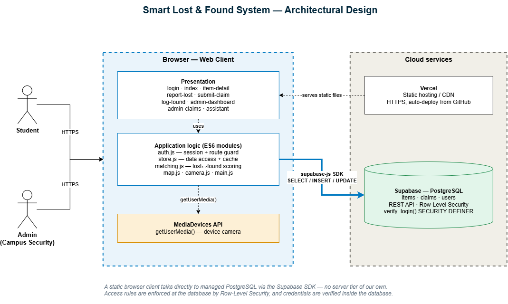
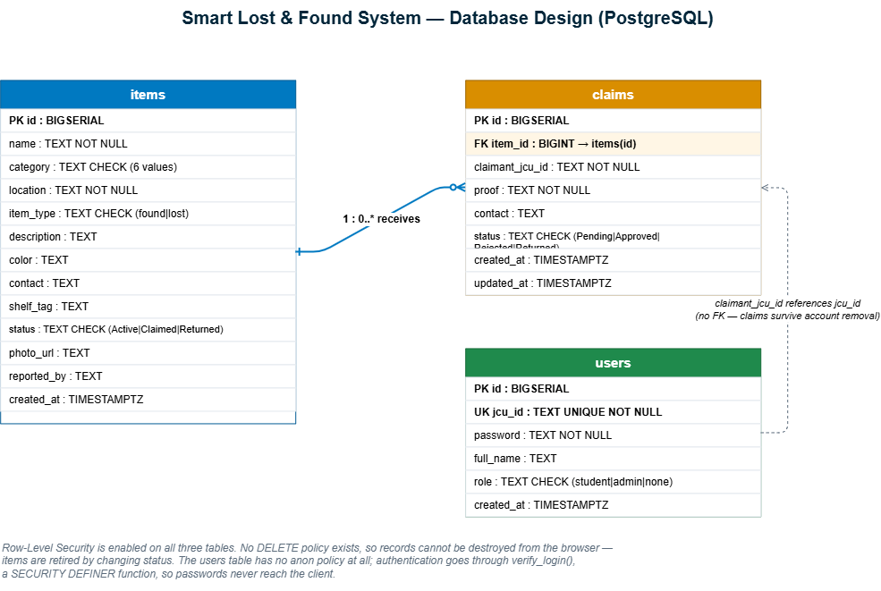
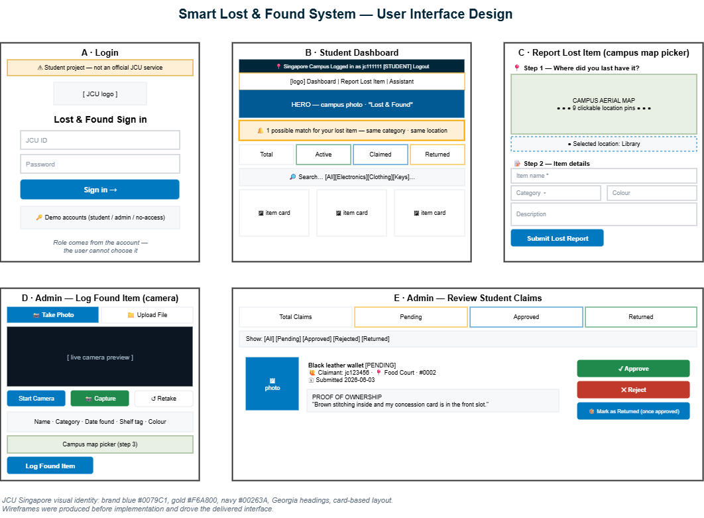

# Smart Lost & Found System — Project Report

**CP3407 Advanced Software Engineering / Projects**
**Group 6 · James Cook University Singapore**

| | |
|---|---|
| **Team** | Yuvraj Dave · João Gabriel Costa · Chiranjeeb Satpathy |
| **Repository** | <https://github.com/929919/Smart-Lost-and-Found-System> |
| **Deployed application** | <https://smart-lost-and-found-system-virid.vercel.app> — ⚠️ Chrome shows a Safe Browsing warning; see [D-03](system-testing-plan.md#d-03--the-one-defect-still-open) |
| **Documentation** | [`docs/`](README.md) — 16 pages |
| **Milestone** | 1 — three iterations |

---

## Contents

1. [Executive summary](#1-executive-summary)
2. [Introduction](#2-introduction)
3. [Requirements](#3-requirements)
4. [Design](#4-design)
5. [Implementation](#5-implementation)
6. [Testing](#6-testing)
7. [Version control and development tools](#7-version-control-and-development-tools)
8. [Agile process](#8-agile-process)
9. [Results and evaluation](#9-results-and-evaluation)
10. [Reflection and future work](#10-reflection-and-future-work)
11. [References and appendices](#11-references-and-appendices)

---

## 1. Executive summary

The Smart Lost & Found System is a web application that centralises the
reporting, searching and recovery of lost property on the JCU Singapore campus.
It replaces the current arrangement — a physical logbook at the security office
and scattered social media posts — with a searchable register, a verified claims
process, and automatic matching between what students report lost and what is
handed in.

The system was built over **three iterations** against a backlog of **20 user
stories totalling 71 estimated days**, gathered by interviewing target users.
**Eighteen stories (94% of the estimated effort) were delivered.** The two that
were not are the two lowest-priority stories in the backlog; no *must have* or
*should have* story was dropped.

The delivered system is a browser client backed by a managed **PostgreSQL**
database, deployed publicly over HTTPS. It provides role-based access for
students and campus administrators, camera capture for logging found items, an
interactive campus map for recording locations, and a matching engine that
explains why it believes two items are the same. Quality is supported by **53
automated unit tests**, **34 documented acceptance scenarios**, a system test
procedure, and continuous integration on every push.

---

## 2. Introduction

### 2.1 The problem

Items are lost on campus daily. At present a student who loses something must
visit the security office in person and describe it, while security keeps a
paper log. There is no way to search from outside the office, no record that
survives staff turnover, and no way to be told when a lost item is handed in.
Students frequently give up; items go unclaimed and are eventually discarded.

### 2.2 Vision

> *For JCU Singapore students and campus administrators who need to report and
> recover lost property, the Smart Lost & Found System is a web application that
> centralises found-item listings, an interactive campus map and a verified
> claims process — delivering what is needed, on time and on budget.*

### 2.3 Objectives

1. A searchable, filterable register of items handed in, usable from any device
2. A structured way for students to report losses and claim items, with evidence of ownership
3. Tools for campus security to log items with photographs and physical storage locations
4. Automatic matching between lost reports and found items
5. A modern relational database with integrity enforced at the data tier
6. Access control so that administrative functions are restricted to staff

### 2.4 Scope

**In scope:** the item register, the claims workflow, role-based access, the
campus map location picker, camera capture, matching and a rule-based assistant.

**Out of scope for this milestone:** integration with JCU's identity provider,
email or push notification delivery, and a native mobile application. The
assistant is rule-based rather than a language model.

---

## 3. Requirements

Full detail: **[Requirements & Product Backlog](requirements.md)** and the
per-story pages under **[`user-stories/`](user-stories/)**.

### 3.1 Elicitation

Requirements were gathered by **interviewing target users** in two groups —
students who lose and search for items, and campus security staff who log items
and manage claims. Findings were converted into user stories with a title, a
short description, a **priority on the 10–50 scale** and an **effort estimate in
days**.

### 3.2 Personas

| Persona | Role | Primary need |
|---------|------|--------------|
| **Jack** | Student, searching | Browse and filter what has been handed in |
| **Sarah** | Student, lost an item | Report a loss, ask questions, be told when a match appears |
| **Ethan** | Campus security, logging | Record found items quickly and store them traceably |
| **Peter** | Administrator, claims | Verify ownership and manage the item lifecycle |

### 3.3 Prioritisation

| Tier | Meaning |
|------|---------|
| **P10** | Must have — the core system cannot function without it |
| **P20** | Should have — works, but feels incomplete without it |
| **P30** | Could have — significant value-add |
| **P40** | Low priority — useful enhancement |

### 3.4 The backlog and its budget

**20 stories, 71 estimated days**, allocated across three iterations by priority
and then effort:

| Iteration | Stories | Effort | Focus |
|-----------|:-------:|:------:|-------|
| 1 | 8 | 43 d | P10 — dashboard, search, chatbot, found-item logging, claim workflow |
| 2 | 6 | 18 d | P20 — photographs, responsive design, lost reporting, proof of ownership |
| 3 | 6 | 10 d | P30–P40 — notifications, accounts, access control, duplicate detection, audit trail |

Every P10 story was placed in Iteration 1 so that the first demonstration showed
a usable system rather than fragments. The lowest-priority work was scheduled
last, so that if the budget ran out the least valuable work would be what was
lost. That is precisely what happened, and is discussed in section 9.

---

## 4. Design

Full detail: **[Design](design.md)**. Diagrams were produced in **draw.io**, an
online diagramming tool; the editable sources are committed under
[`docs/diagrams/`](diagrams/).

### 4.1 Architecture

The system is a **static browser client that talks directly to a managed
PostgreSQL database**, with no server tier of the team's own. The client is
served as static files from a CDN; data access goes through the Supabase
JavaScript SDK, which exposes PostgreSQL over HTTPS.

**Why this shape.** The project began as a Flask API with a React front end.
That stack never reached a demonstrable state and required three deployable
parts for what is fundamentally a form-and-list application. Removing the
middle tier eliminated an entire class of failure without giving up the
relational database — access rules moved into the database itself as row-level
security policies, which is a stronger place for them than application code.

The client is organised in three layers: presentation (eleven pages), application
logic (`auth.js`, `store.js`, `matching.js`, `map.js`, `camera.js`, `main.js`),
and the data tier.

### 4.2 Database

Three tables in PostgreSQL. `items` holds both found items and lost reports,
separated by `item_type`, so one query serves the dashboard and one engine
serves matching. `claims` references `items` by foreign key, which is what allows
approving a claim to transition the item in the same action. `users` holds
accounts and roles.

**Integrity is enforced at the database, not only in the client.** `CHECK`
constraints restrict category, item type, status and role to their valid values,
so invalid data cannot be stored even if the client is bypassed.

**Security properties.** Row-level security is enabled on all three tables with
**no `DELETE` policy**, so records cannot be destroyed from the browser — items
are retired by changing status. The `users` table has no policy for the browser
role at all: authentication goes through `verify_login()`, a `SECURITY DEFINER`
function that checks credentials inside the database and returns only the
identifier, name and role. Passwords never reach the client.

### 4.3 User interface

The interface follows the JCU Singapore visual identity — brand blue `#0079C1`,
gold `#F6A800`, navy `#00263A`, serif headings and card-based layouts — so that
it reads as a campus service. Wireframes were produced for the five key screens
before implementation; screenshots of the delivered result are in
[Implementation](implementation.md), allowing the intended and actual designs to
be compared.

Two interactions received particular attention. **Location** is captured by
clicking a pin on an aerial photograph of the campus rather than typing free
text, which makes location a consistent, filterable value. **Photographs** are
captured directly from the device camera, because an officer logging an item has
a phone in hand and a photograph is the single most useful field for
recognition.

---

## 5. Implementation

Full detail: **[Implementation](implementation.md)**.

### 5.1 Technology

| Layer | Choice | Rationale |
|-------|--------|-----------|
| Client | HTML5, CSS3, vanilla JavaScript | No build step; effort went into features, testing and documentation rather than tooling |
| Database | Supabase (PostgreSQL) | Managed relational database with a REST interface and row-level security |
| Hosting | Vercel | Static hosting with HTTPS and automatic deployment from the repository |
| Media | MediaDevices API | Camera capture without a third-party dependency |
| CI | GitHub Actions with Playwright | Runs the browser test suite on every push |

### 5.2 What each iteration delivered

**Iteration 1 — core.** The found-items dashboard with live statistics, the
search and filter engine, the assistant with live record querying, the
found-item logging form with storage tagging, claim verification and the status
lifecycle.

**Iteration 2 — usability and trust.** Photographs displayed and uploaded,
responsive layout, the lost-item reporting form with the campus map picker,
required-field rules, and claims carrying proof of ownership. Role-based access
was brought forward from Iteration 3 because the claims workflow could not be
demonstrated safely without it.

**Iteration 3 — persistence, deployment and matching.** The clean grid default,
match notifications, accounts and authentication, and administrator access
control. Iteration 3 also absorbed four items of unplanned work: the PostgreSQL
migration, the automated test suite, public deployment and an accessibility pass.

### 5.3 Notable implementation decisions

**Load-once-then-cache.** Moving to a database introduced asynchronous data
access, while every rendering function was synchronous. Rather than rewrite
every page, the data layer loads items and claims once on startup and caches
them; reads stay synchronous and writes are applied optimistically then
persisted in the background. No rendering code changed.

**Graceful degradation.** If the database cannot be reached the application
falls back to local demonstration data and displays a warning banner instead of
failing. This was proven in practice: during deployment the schema had not yet
been created, and the application remained usable throughout.

**Explainable matching.** The matching engine scores a lost report against every
active found item — category, location, colour, shared keywords and date
proximity — and returns **the reasons** alongside the score, so a student sees
*why* two items were matched rather than being asked to trust a number.

**Accessibility.** Keyboard navigation with visible focus, a skip link, ARIA live
regions for dynamic content, `role="alert"` on validation messages, and
`prefers-reduced-motion` support.

---

## 6. Testing

Full detail: **[Testing](testing.md)**, **[Acceptance tests](acceptance-tests.md)**,
**[System testing plan and defect log](system-testing-plan.md)**.

### 6.1 Strategy

| Level | Coverage | Evidence |
|-------|----------|----------|
| Unit | Data layer, claims workflow, matching engine, authentication | **53 automated assertions** |
| Integration | Client to PostgreSQL; claim approval across two tables | Verified in the database |
| System | Whole journeys for both roles | Procedure ST-1 to ST-6 |
| Acceptance | One or more scenarios per story | **34 scenarios**, all passing |
| Non-functional | Responsive, keyboard, screen reader, offline | Documented checks |

The unit suite runs by opening a file in a browser — no installation — and is
also driven headlessly in continuous integration, so the automated and manual
runs cannot diverge.

### 6.2 Test-driven development

The claims workflow was written test-first: the assertions that approving a
claim must set the claim to *Approved* **and** its item to *Claimed* were written
before the implementation, and drove the design of `Claims.approve()`.

### 6.3 Mock objects

Authentication calls `verify_login()` inside PostgreSQL. Testing it against the
live database would be slow, network-dependent, and — most importantly — unable
to exercise failure paths on demand.

Jest, Sinon and Vitest were considered and rejected: each would have introduced
Node, npm and a bundler purely for testing, and the suite would have stopped
being runnable by opening a file. A **60-line mock framework** was written
instead, providing a spy that records calls, a fake database client with
swappable responses, and canned replies for success, no match, RPC error and
network failure.

This made testable what previously was not: that `verify_login` was called
exactly once with the credentials as named parameters (an *interaction*
assertion), that a database outage falls back to local accounts, and — the case
that matters most — that **the fallback still rejects a wrong password**. A
fallback that accepted anything would be an authentication bypass, and it is
only reachable when the database is down, so without a mock it would realistically
never have been tested.

### 6.4 Defects

Ten defects were recorded and classified. **Nine are closed; D-03 remains open
at the time of submission** — Google Safe Browsing still classifies the deployed
site as phishing, so Chrome shows a warning before it loads. The cause has been
removed and a re-review has been requested, but the verdict rests with Google
rather than the team, so it is reported as open rather than closed. Full detail,
and how to reach the working system meanwhile, is in
[D-03](system-testing-plan.md#d-03--the-one-defect-still-open).

The discovery sources are instructive:

- **Two were raised by the client during the Iteration 3 demonstration** — dead footer links, and the assistant giving identical answers to both roles. Both were fixed and committed the same day.
- **One was found by the automated tests** — the seed data was being mutated in memory, so "reset demo data" did not fully reset. Manual testing had missed it; a regression test now guards it.
- **Two were only exposed by deploying** — a missing database migration and a Safe Browsing phishing classification. Neither was reproducible locally, which is the argument for deploying early rather than at the end.
- **One was found by inspection while fixing another** — re-running the schema would have duplicated every seed item. It had never actually fired.

---

## 7. Version control and development tools

Full detail: **[Version control](version-control.md)**, **[Build and development tools](tools.md)**.

- **One repository**, `main` always demonstrable, feature work on branches merged by pull request.
- **Story-tagged commit messages**, so history maps to the backlog. Where identifiers became ambiguous between iterations, the mapping is documented in [Requirements](requirements.md) rather than left unexplained.
- **Release tags** `v1.0`, `v2.0`, `v3.0` marking each iteration, with each iteration preserved as its own folder so incremental progress is directly comparable.
- **Continuous integration** on every push: documentation links resolve, required files and story pages exist, every page carries its route guard, the documented test count matches the suite, the iteration snapshots are unmodified, no privileged database key is committed, all scripts parse, and the browser test suite passes with no console errors.

---

## 8. Agile process

Full detail: **[Agile process](agile.md)**.

### 8.1 Velocity

| Iteration | Planned | Delivered | Velocity |
|-----------|:-------:|:---------:|:--------:|
| 1 | 43 d | 43 d | 43 |
| 2 | 18 d | 18 d | 18 |
| 3 | 10 d | 6 d planned + 7 d unplanned | 13 |

**Velocity was used to adjust the plan.** Iteration 1 delivered its full 43
story-days but tracked behind the ideal line for the entire sprint, indicating
over-commitment. Iterations 2 and 3 were therefore deliberately committed at 18
and 10 story-days. Iteration 2 then landed exactly on plan, confirming the
correction.

### 8.2 Burn-down

The Iteration 3 chart is the most informative of the three. **The line rises
twice**, where unplanned work was taken on, and it ends with four story-days
outstanding — the two deferred stories. It is an honest record of a plan meeting
reality.

### 8.3 Reviews and retrospectives

Each iteration ended with a demonstration and a retrospective; both are recorded
in [agile.md](agile.md). The most consequential action was after Iteration 1,
when the team reduced its commitment by more than half in response to measured
velocity.

---

## 9. Results and evaluation

### 9.1 Against the plan

| Measure | Result |
|---------|--------|
| Stories delivered | **18 of 20 (90%)** |
| Estimated effort delivered | **67 of 71 days (94%)** |
| Must-have (P10) stories | **8 of 8** |
| Should-have (P20) stories | **6 of 6** |
| Deferred | 2 — both P30/P40 |

### 9.2 What was not delivered

| Story | Priority | Reason |
|-------|:--------:|--------|
| 3.5 Duplicate detection | P30 | Iteration 3 absorbed the unplanned database and deployment work. The matching engine built for story 2.4 already provides the similarity comparison, so what remains is a warning interface at logging time. |
| 4.5 Audit trail | P40 | The lowest-priority story in the backlog. Partially mitigated: claim decisions already carry timestamps, and row-level security prevents records being deleted from the client. |

Both were *could have* and *low priority*. The prioritisation scheme existed
precisely so that, under pressure, the least valuable work would be what was
lost — and that is what occurred.

### 9.3 Against the project requirements

| Requirement | Met |
|-------------|-----|
| A software development project requiring source code | ✅ ~2,500 lines of HTML, CSS, JavaScript and SQL |
| Use of productivity tools and libraries | ✅ Supabase, supabase-js, Vercel, Playwright, MediaDevices |
| A modern relational database | ✅ PostgreSQL — three tables, foreign key, CHECK constraints, row-level security |
| A modern graphical user interface | ✅ Eleven responsive pages |

---

## 10. Reflection and future work

### 10.1 What worked

**Prioritising ruthlessly.** Placing every must-have story in the first iteration
meant the first demonstration showed something usable. When effort ran short in
the final iteration, the decision about what to cut had already been made.

**Extracting shared components.** The campus map picker, camera tool and shared
page chrome were each written once and reused. Each new page cost less than the
last, and late changes — role-aware navigation, a site-wide disclaimer — were
single-line edits rather than eleven.

**Automated tests earning their keep.** The suite found a real defect that manual
testing had missed, and the mock-based tests proved a security property that
could not otherwise have been checked.

### 10.2 What the team would do differently

**Estimate non-functional work.** This was the project's most consistent
weakness, and it appeared twice. At elicitation, two requirements gathered from
users — *performance* and *reliability* — never became stories, because the
team's story format assumed a user-facing feature and neither fitted that shape.
Later, the database migration, deployment, test suite and accessibility pass
amounted to seven story-days that were equally absent from the backlog and
therefore had no budget; they displaced two features. The database in particular
was implied by the project requirements from the very start and should have
carried an estimate in Iteration 1. A backlog that admits non-functional stories,
with acceptance criteria that can be measured, would have prevented both.

**Commit in smaller increments.** Work was committed in large batches, which is
why progress had to be reconstructed for the burn-down charts rather than read
directly from the history.

**Deploy earlier.** Two defects were only discoverable once deployed. Deploying
in Iteration 1, even with an incomplete application, would have surfaced them
when there was time to respond calmly.

### 10.3 Future work

| Priority | Item |
|:--------:|------|
| High | Complete stories 3.5 and 4.5 |
| High | Replace the credential table with Supabase Auth, using hashed passwords and session tokens; integrate with JCU identity |
| Medium | Deliver match notifications by email rather than only on the dashboard |
| Medium | Move photographs to object storage rather than storing them in the row |
| Medium | Replace the rule-based assistant with a language model |
| Low | Split `store.js`, which currently carries data access, connection bootstrap, row mapping and view helpers (see [code quality](code-quality.md)) |

---

## 11. References and appendices

### Documentation
| Page | Contents |
|------|----------|
| [Requirements](requirements.md) | Backlog, personas, priorities, estimates, completed vs unfinished |
| [User stories](user-stories/) | 20 pages: acceptance criteria, task breakdown, implementation, tests |
| [Design](design.md) | Architecture, database, interface |
| [Implementation](implementation.md) | Delivery per iteration, screenshots of the running system |
| [Testing](testing.md) | Strategy, TDD, mock objects, accessibility |
| [Acceptance tests](acceptance-tests.md) | 34 Given/When/Then scenarios and traceability matrix |
| [System testing plan](system-testing-plan.md) | Test procedure, defect management, defect log |
| [Code quality](code-quality.md) | SRP and DRY review |
| [Agile process](agile.md) | Velocity, burn-down charts, reviews, retrospectives |
| [Version control](version-control.md) | Branching, commit conventions, releases |
| [Build and development tools](tools.md) | Tools, libraries, continuous integration |
| [How to test](HOW-TO-TEST.md) | Walkthrough for a reviewer |
| [Deployment guide](DEPLOYMENT.md) | Publishing procedure |

### Source documents
- `User_Stories.docx` — interview findings and priority ranking (Practical 2)
- `Practical_Week3_Iteration1.docx` — iteration allocation, board and burn-down (Practical 3)

### Team contributions

| Member | Contribution |
|--------|--------------|
| **Yuvraj Dave** | Application development across all three iterations — the data layer, authentication and access control, the claims workflow, camera capture, the campus map picker and the matching engine. Database design and the Supabase migration. Deployment, the test suite and continuous integration. |
| **João Gabriel Costa** | Repository administration and the GitHub workflow. Practical submissions, including the requirements gathering and iteration planning documents. Page layout and ongoing maintenance of the project materials. |
| **Chiranjeeb Satpathy** | Limited contribution to the delivered work. |

> The distribution of work was uneven. It is recorded accurately here rather
> than averaged, so that the effort behind the delivered system is clear.
