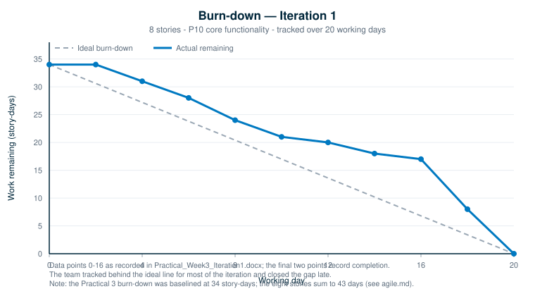
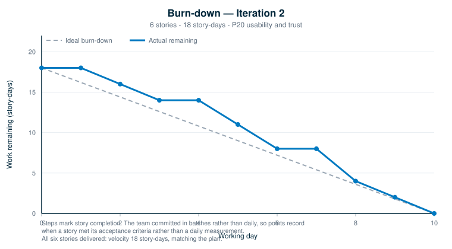
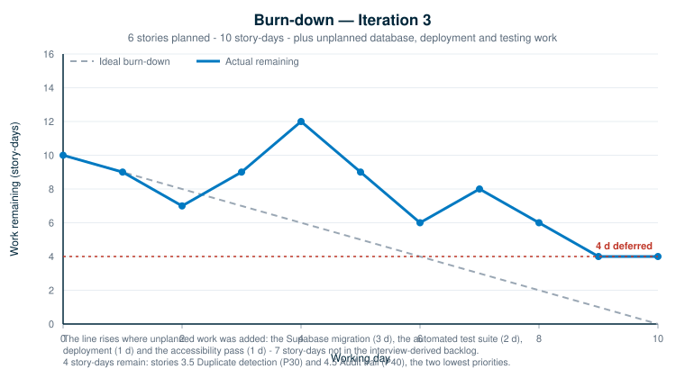

# Agile Software Engineering

← [Back to documentation home](README.md)

How the project applied **iterative, incremental development**: planning against
a prioritised backlog, tracking work on a board, measuring velocity, reviewing
each iteration and adjusting the next. Supports **Rubric Criterion 7**, and
records the outcomes of **Practicals 3, 4, 5, 6 and 8**.

---

## Process

Three timeboxed iterations forming Milestone 1. Each iteration: plan from the
prioritised backlog → build → demonstrate → review and retrospect → use the
measured velocity to adjust the next plan.

The backlog is in [Requirements](requirements.md); each story has its own page
under [`user-stories/`](user-stories/) carrying its task breakdown, acceptance
criteria and status label.

## Task tracking

Stories were broken into tasks with individual estimates *(Practical 4, task 1)*
and tracked with **Todo / In progress / Done** labels *(Practicals 4, 5, 6, 8)*.
Every story page shows the breakdown and the current label; the summary is in
[Requirements](requirements.md).

### Moving tracking off the documentation pages *(Practical 9.3)*

Editing a status label inside a Markdown table is a poor substitute for task
tracking: it carries no history, no assignee, and cannot be queried. The backlog
was therefore mirrored into GitHub's own tools, where the same information is
live, assignable and filterable:

| Mechanism | Where |
|-----------|-------|
| **Issues** — one per backlog story | [the 20 story issues](https://github.com/929919/Smart-Lost-and-Found-System/issues?q=label%3Auser-story) |
| **Projects board** — Todo / In Progress / Done | [Smart Lost & Found — Product Backlog](https://github.com/users/uv-22/projects/1) |
| **Milestones** — one per iteration | [Iterations 1–3](https://github.com/929919/Smart-Lost-and-Found-System/milestones) |
| **Labels** — epic, priority P10–P40, iteration | applied to every issue |

Each issue carries the persona, priority, day estimate, acceptance criteria and
task breakdown taken from its story page, and links back to that page. The 18
delivered stories are **closed**; **3.5 Duplicate detection** and **4.5 Audit
trail** remain **open** — the same 18-of-20 position recorded in
[Requirements](requirements.md), now enforced by the issue state rather than by
a hand-edited table.

Two further issues record the requirements-gathering and iteration-planning work
of Practicals 2 and 3. That work produced `User_Stories.docx` and
`Practical_Week3_Iteration1.docx` rather than application code, so it is not one
of the 20 stories, but it was real effort by a named team member and is tracked
as such.

**When this was done, stated plainly.** The issues, milestones and board were
created at the close of Iteration 3. They were not maintained live across the
three iterations, and the issue timestamps show this. During the iterations
themselves, tracking was the status labels on the story pages together with the
Kanban board in `Practical_Week3_Iteration1.docx`. Nothing sits in **In
Progress** on the board because no work is currently underway — an empty column
is the honest state, not an oversight.

---

## Velocity

Effort is measured in **story-days**, as estimated during Practical 2.

| Iteration | Planned | Delivered | Velocity | Against plan |
|-----------|:-------:|:---------:|:--------:|--------------|
| **Iteration 1** | 43 d | 43 d | **43** | On plan — all 8 P10 stories |
| **Iteration 2** | 18 d | 18 d | **18** | On plan — all 6 P20 stories |
| **Iteration 3** | 10 d | 6 d planned **+ 7 d unplanned** | **13** | 2 stories deferred; unplanned work absorbed |
| **Total** | **71 d** | **67 d of backlog** | | **18 of 20 stories (94%)** |

**How velocity was used.** Iteration 1 delivered 43 story-days but was tracking
behind for most of the sprint (see the chart below), which indicated the
estimate-to-capacity ratio was too aggressive. Iterations 2 and 3 were therefore
planned at 18 and 10 story-days respectively — a deliberate reduction. Iteration
2 then landed exactly on plan, confirming the corrected sizing.

---

## Burn-down charts

### Iteration 1

Tracked behind the ideal line from day 2 onward. The eight P10 stories were all
delivered, but the late catch-up showed the iteration had been over-committed.

> **Data note.** The Practical 3 burn-down was baselined at **34 story-days**,
> while the eight Iteration 1 stories sum to **43 days** in `User_Stories.docx`.
> The discrepancy is in the original submission and is reproduced here rather
> than silently corrected. The velocity table uses the story estimates (43).

### Iteration 2

Tracked close to ideal throughout and finished on plan. The reduced commitment
after Iteration 1 proved to be the right correction.

### Iteration 3

**The line rises twice** — this iteration took on work that was not in the
interview-derived backlog:

| Unplanned work | Effort | Why it could not wait |
|----------------|:------:|-----------------------|
| Migration to Supabase PostgreSQL | 3 d | The project requires a modern relational database; the prototype used browser storage |
| Automated test suite | 2 d | Practical 7 required at least 15 automated tests |
| Public deployment | 1 d | Needed for demonstration; camera capture also requires HTTPS |
| Accessibility pass | 1 d | Keyboard access, focus states, live regions |

Seven story-days of added scope against a ten-day iteration. The consequence is
visible: the chart ends at **4 story-days remaining**, which are stories **3.5
Duplicate detection (P30)** and **4.5 Audit trail (P40)** — the two lowest
priorities in the whole backlog. No Must or Should story was sacrificed, which
is precisely what the prioritisation existed to protect.

> **Method note.** The team committed in batches rather than daily, so the points
> on the Iteration 2 and 3 charts mark **story completion** — the moment a story
> met its acceptance criteria — rather than daily measurements.

---

## Iteration log

### Iteration 1 — Core functionality *(8 stories, 43 d, all P10)*
- **Planned:** dashboard, search and filter, chatbot with live querying, found-item logging, storage tagging, claim verification, status lifecycle.
- **Delivered:** all eight stories.
- **Review:** demonstrated to the client in the practical class. The increment was well received and **no issues were raised**.
- **Observations from the project record**:
  - Prioritising every P10 story into one iteration meant the first increment was a usable system rather than fragments.
  - Work was committed in large batches — 71 commits fall on only eight distinct days across the project — which is why the burn-down had to be reconstructed from story completion rather than read from daily measurements.
  - The next commitment was reduced from 43 to 18 story-days, so the over-commitment was recognised and acted on.
- **Retrospective:** with no defects raised, the retrospective focused on process rather than product — see the observations above and the actions carried into the next iteration.

### Iteration 2 — Usability and trust *(6 stories, 18 d, all P20)*
- **Planned:** photo display and upload, responsive design, lost-item reporting, required-field rules, claim with proof of ownership.
- **Delivered:** all six stories, plus role-based access brought forward from the Iteration 3 plan because the claims workflow could not be demonstrated safely without it.
- **Review:** demonstrated to the client in the practical class. Again well received, with **no issues raised**.
- **Observations from the project record**:
  - Extracting shared components (`map.js`, `camera.js`, `main.js`) meant each later page reused existing work rather than repeating it.
  - No automated tests existed at this point; defects were caught only by manual checking. The suite arrived in Iteration 3.
- **Retrospective:** with no defects raised, the retrospective focused on process rather than product — see the observations above and the actions carried into the next iteration.

### Iteration 3 — Persistence, deployment and matching *(6 stories planned, 10 d)*
- **Planned:** clean grid, match notifications, accounts and authentication, duplicate detection, admin roles, audit trail.
- **Delivered:** 1.5, 2.4, 2.5 and 4.4, plus the four unplanned items above. **3.5 and 4.5 deferred.**
- **Review:** demonstrated to the client (course lecturer) on the team's laptop in the week 10 practical. Two defects were raised — inoperative footer links, and the assistant returning identical answers to students and administrators. Both were fixed and committed the same day; logged as D-04 and D-05.
- **Retrospective:** *(recorded after the demonstration)*
  - *Went well* — the automated tests caught a real defect during development (seed data was being mutated in memory, so "reset demo data" did not fully reset). A regression test now guards it. Graceful degradation to local data also meant the database being unavailable never blocked a demonstration.
  - *Improve* — the unplanned work was foreseeable. The database migration was implied by the project requirements from the start and should have been a backlog story with an estimate in Iteration 1, rather than arriving as unbudgeted work in the final iteration.
  - *Action* — recorded 3.5 and 4.5 with the reasoning for deferral and what remains; the matching engine built for 2.4 already provides most of what 3.5 needs.

---

## Roles and collaboration

- Work split by epic across the three members, with pairing on the claims workflow.
- Asynchronous stand-ups in the team chat: done / next / blockers.
- **Definition of Done:** the story is demonstrable, its acceptance criteria pass, no console errors, the unit suite is green, and the change is committed with a message naming the story.

## What the team would change

The single biggest process lesson is that **non-functional requirements need
estimates too** — and the project made the same mistake twice.

At elicitation, *performance* and *reliability* were gathered from users and
given priorities, then never became stories (see the traceability note in
[requirements.md](requirements.md)). Later, the database migration, deployment,
testing and accessibility work — seven story-days of real engineering effort —
was equally absent from the backlog and therefore unbudgeted, and ultimately
displaced two features.

The common cause is a story format that assumed every requirement is a
user-facing feature. Had non-functional work been admitted to the backlog with
measurable acceptance criteria, the commitment would have been adjusted at
planning time rather than the scope cut at the end.
