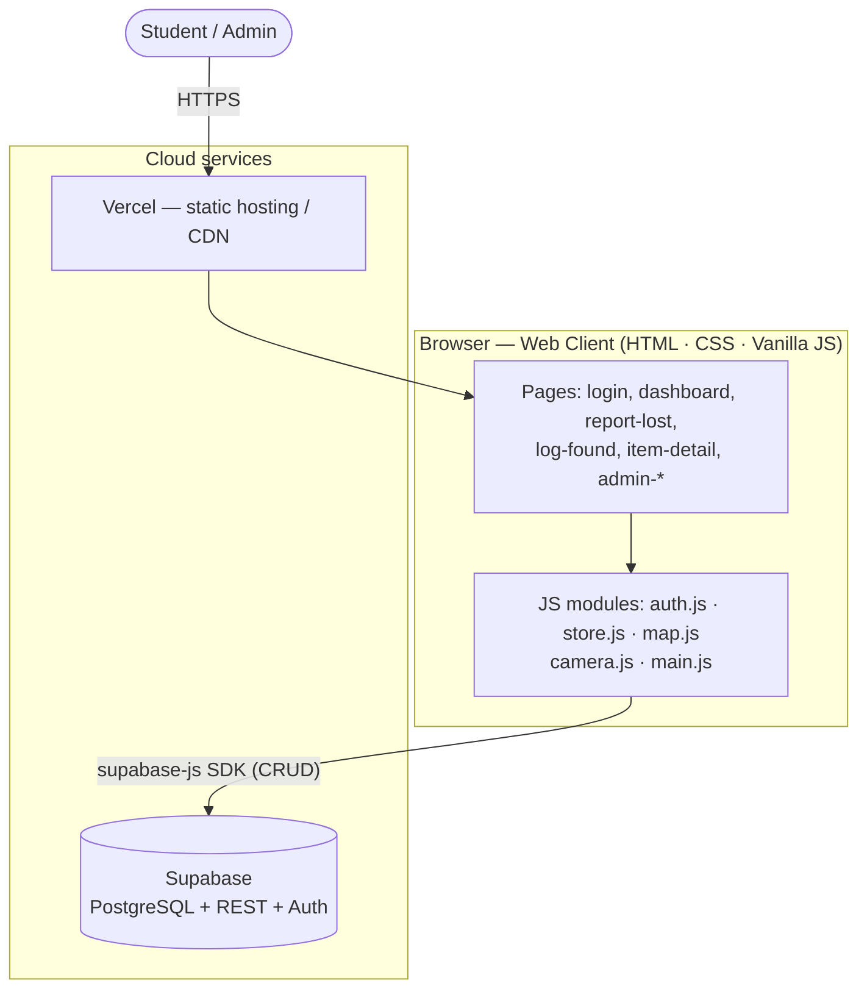
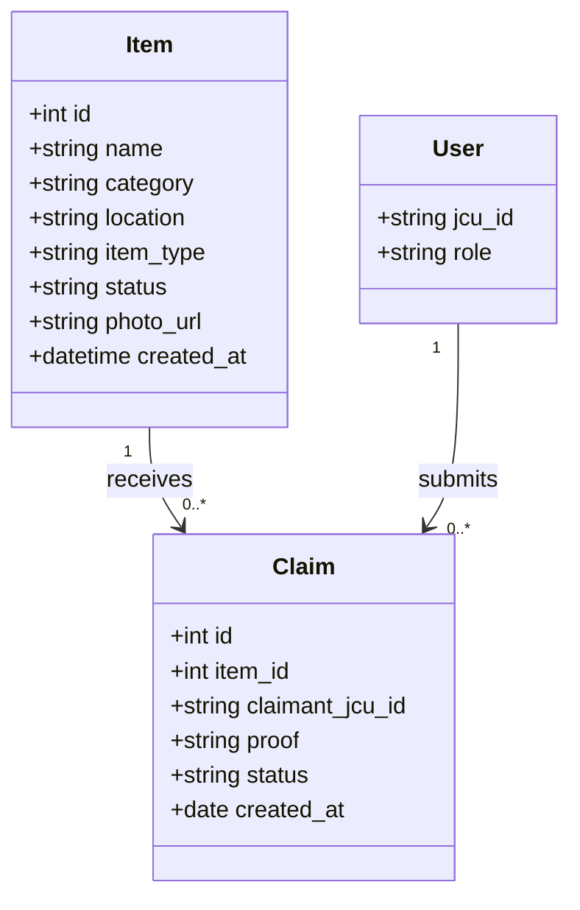
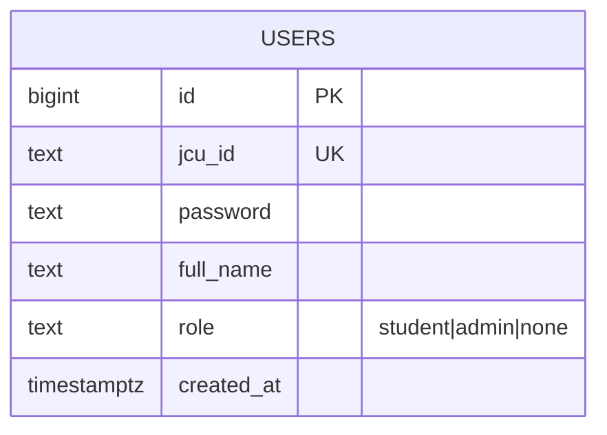
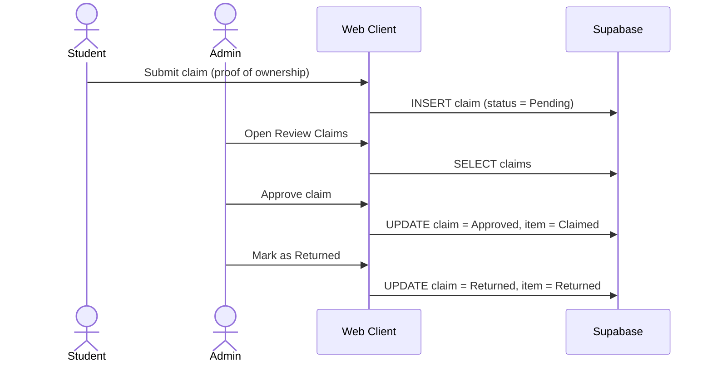

# Design

← [Back to documentation home](README.md)

Design of all major components: **architecture**, **database**, and **user
interface**. Supports **Rubric Criterion 2 — Design**. Diagrams below render on
GitHub; we also modelled them in the required online tools (links noted).

> 🛠️ **Building the tool-based diagrams?** Every box, column and screen element is
> specified in **[diagram-specs.md](diagram-specs.md)** — ready to reproduce in
> Gliffy, GenMyModel and NinjaMock.

---

## 1. Architectural design

The system is a **static single-page-style web client** that talks directly to
**Supabase** (managed PostgreSQL + auto-generated REST API) using the
`supabase-js` browser SDK, and is hosted as static files on **Vercel**. This
"JAMstack" approach needs no server of our own, yet still uses a real relational
database.

> 🛠️ Also produced as a UML diagram in **Gliffy**: _add link_

**Layering / separation of concerns**
- **Presentation** — HTML pages + `styles.css` (JCU design system).
- **Application logic** — `store.js` (data access), `auth.js` (session + route guard), `map.js`, `camera.js`, `main.js` (shared chrome).
- **Data** — Supabase Postgres (`items`, `claims` tables) with Row-Level Security.

### Domain model (class diagram)

---

## 2. Database design

Modern **relational** database (PostgreSQL via Supabase). Two tables with a
one-to-many relationship; `CHECK` constraints enforce valid enums; Row-Level
Security governs access.

```mermaid
erDiagram
  ITEMS ||--o{ CLAIMS : "has"
  ITEMS {
    bigint id PK
    text name
    text category "Electronics|Accessories|Clothing|Documents|Keys|Other"
    text location
    text item_type "found|lost"
    text description
    text color
    text contact
    text shelf_tag
    text status "Active|Claimed|Returned"
    text photo_url
    timestamptz created_at
  }
  CLAIMS {
    bigint id PK
    bigint item_id FK
    text claimant_jcu_id
    text proof
    text contact
    text status "Pending|Approved|Rejected|Returned"
    date created_at
    date updated_at
  }
```

The authoritative SQL lives in **[`iteration 3/db/`](../iteration%203/db)**:
[`schema.sql`](../iteration%203/db/schema.sql) (items + claims) and
[`users.sql`](../iteration%203/db/users.sql) (accounts + the `verify_login`
function). *(`backend/supabase_schema.sql` is an earlier draft kept for history —
do not run it.)*

### Third table — `users` (authentication)

`users` is deliberately **not** linked by a foreign key to `claims`; claims store
the claimant's JCU ID as text so a claim survives an account being removed.

> 🛠️ Also modelled in **GenMyModel** (online DB diagram tool): _add link_

**Design decisions**
- Both *lost* and *found* reports live in one `items` table, distinguished by `item_type` — simpler queries, one dashboard.
- `claims` reference `items` by FK so approving a claim can transition the item's `status`.
- **Row-Level Security is enabled with no `DELETE` policy on either table.** Reads, inserts and updates are permitted; deletes issued from the browser are silently rejected, so item and claim history cannot be destroyed by a client. Records are retired by changing `status`, never removed.
- The browser holds only the **anon/publishable key**; the `service_role` key is never shipped to the client.
- Users are **not** stored in a table this release (open, password-less login) — role lives in the session only. Documented as a deliberate scope decision (see [Requirements](requirements.md)).

---

## 3. User interface design

The UI follows an official **JCU Singapore** visual language: brand blue
`#0079c1` + gold `#f6a800`, Georgia headings, card-based layouts, an interactive
campus aerial as the location picker, and a persistent utility bar + footer.

**Key screens:** Login (role cards) · Dashboard (search/filter grid) · Report
Lost (map picker) · Log Found (camera + upload) · Item Detail · Submit Claim ·
Admin Dashboard · Review Claims.

### Interaction example — claim & approval flow

> 🛠️ Interactive wireframes/prototype built in **NinjaMock**: _add link_
> 📸 Screenshots of the delivered UI: see [Implementation](implementation.md).
