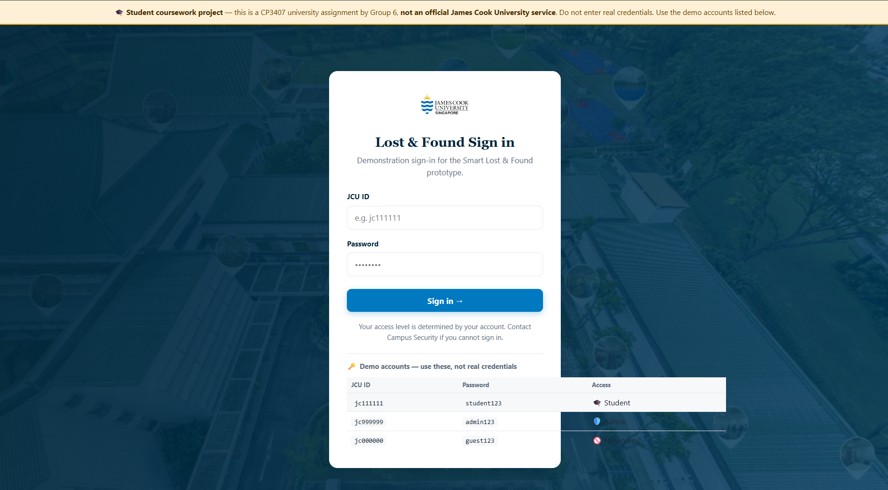
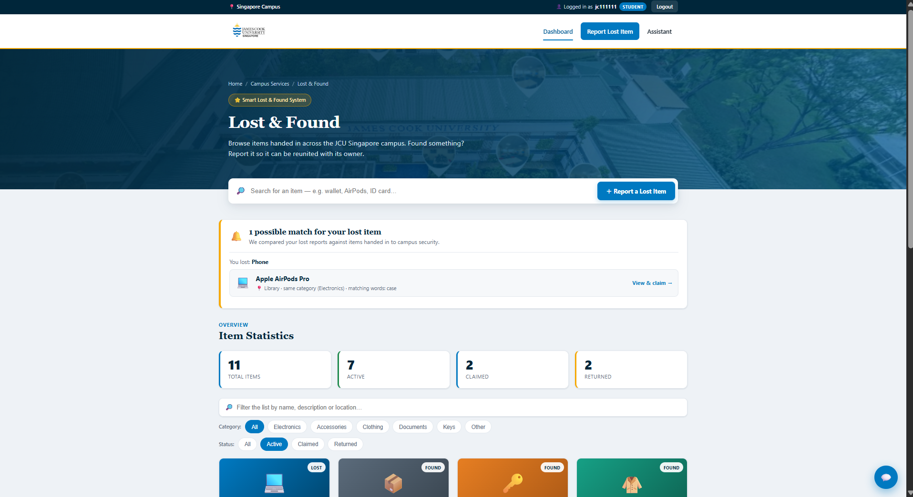
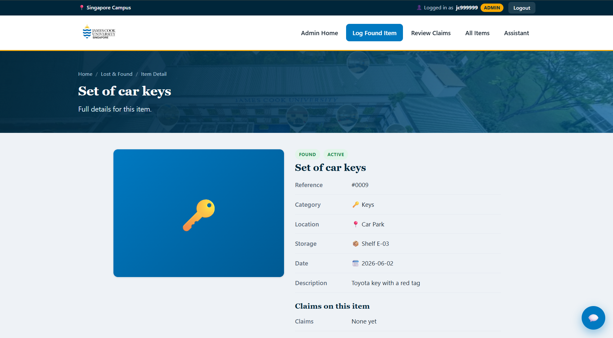
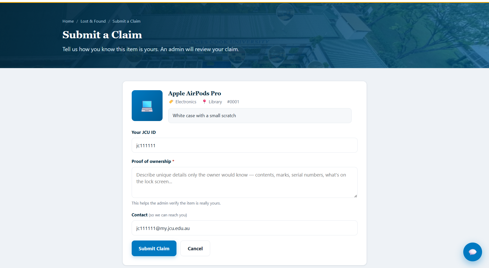
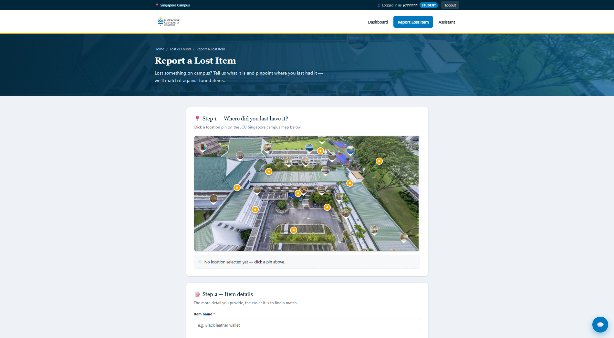
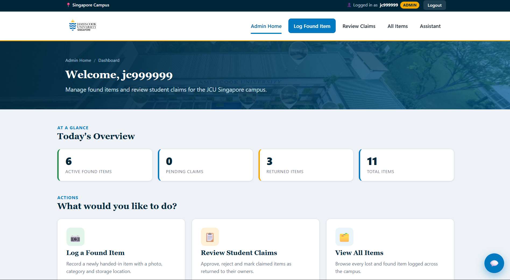
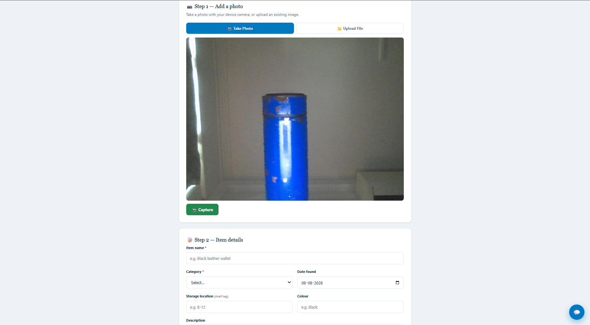
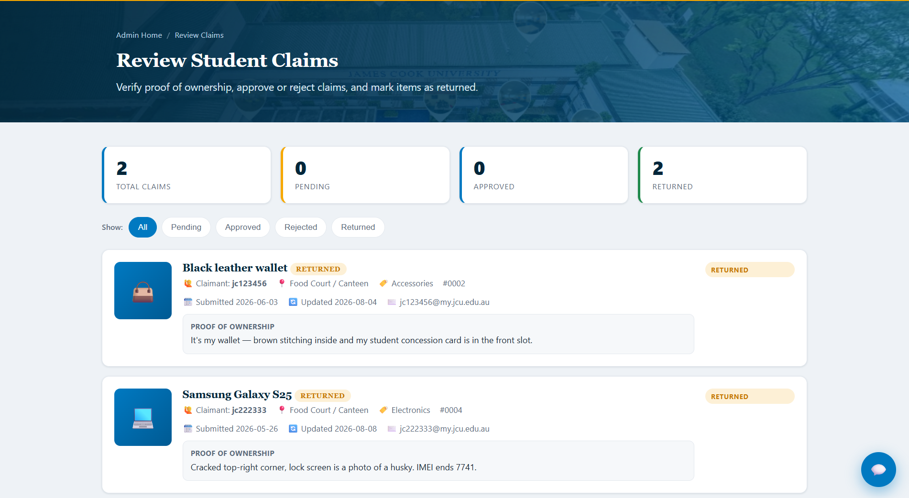

# Implementation / Code

← [Back to documentation home](README.md)

What we delivered each iteration — *"what is needed, on time and on budget"* —
plus the technology choices and how to see it running. Supports **Rubric
Criterion 3 — Implementation / Code**.

> 🔗 **Deployed app:** <https://smart-lost-and-found-system-virid.vercel.app> · 🎥 **Demo video:** _add link_

---

## Technology stack

| Layer | Choice | Why |
|-------|--------|-----|
| Front end | HTML5 + CSS3 + **vanilla JavaScript** (no framework) | Zero build friction, fast to iterate, easy to host and mark |
| Database | **Supabase (PostgreSQL)** | Modern managed relational DB with REST API + Row-Level Security |
| Data access | `supabase-js` browser SDK | Talk to Postgres directly from static pages |
| Hosting | **Vercel** (static) | One-click deploy, free HTTPS + CDN |
| Media | `getUserMedia` + `<canvas>` → base64 | Camera capture for found items, no upload server |
| Diagrams / docs | Mermaid on GitHub | Design diagrams render inline |

## What we delivered, by iteration

### Iteration 1 — Browse & report (foundation)
- Found-items **dashboard** with search + category/status filters and live stats.
- **Report** form with an **interactive JCU campus map** location picker.
- Rule-based **help assistant**.
- Delivered as a polished, responsive static site (`iteration 1/`).

### Iteration 2 — Roles, claims & camera (current app)
- **Role-based login** (Student / Admin) with a route guard (`auth.js`).
- Student: **submit claims** with proof of ownership, item detail pages.
- Admin: **admin dashboard**, **log found items with camera or file upload** (`camera.js`), **review claims** (approve / reject / mark returned), item status table.
- Shared role-aware header/nav, logged-in indicator + logout, floating chat widget (`iteration 2/`).

### Iteration 3 — Persistence, deployment & matching
- ✅ **Lost ↔ found auto-matching** (`matching.js`) — scores every active found item against a student's lost report (category, location, colour, shared keywords, date proximity) and surfaces ranked matches on their dashboard **with the reasons for each match**.
- ✅ **Automated test suite** — 53 unit tests, zero-install runner (see [Testing](testing.md)).
- ✅ **Supabase PostgreSQL backend** (story 5.1) — the data layer now reads and writes a managed cloud Postgres database via the `supabase-js` browser SDK. Uses a *load-once-then-cache* design so page rendering stays synchronous, with optimistic writes persisted in the background. If the database is unreachable the app **degrades gracefully** to local demo data and shows a warning banner rather than failing.
- ✅ **Deployed to a public HTTPS URL** (story 5.2) — <https://smart-lost-and-found-system-virid.vercel.app>, hosted as static files on Vercel and redeployed automatically on every push to `main`. HTTPS also enables the camera on real mobile devices.

## Client demonstration and feedback

The client for this project is the course lecturer, who reviews the delivered
increment at the end of each iteration.

### Iteration 3 — week 10 practical

The application was demonstrated on the team's laptop against the live database.
The walkthrough covered both roles, access control, the campus map picker, camera
capture and the claims workflow, followed by the database, the test suite and the
repository.

**Two defects were raised:**

| Defect | Resolution |
|--------|------------|
| Footer links were inoperative — eleven placeholder `href="#"` links implying services that do not exist | Replaced with working destinations (repository, documentation, testing guide, test runner, the JCU site) and the invented social links removed. Logged as **D-04**. |
| The assistant returned identical answers to students and administrators | Branched by role — students receive recovery guidance, administrators an operational summary drawn from live database counts. Logged as **D-05**. |

Both were fixed and committed the same day. See the
[defect log](system-testing-plan.md#7-defect-log).

### Iterations 1 and 2

| Iteration | Demonstrated | Feedback received | Action taken |
|-----------|--------------|-------------------|--------------|
| 1 | Practical class — the dashboard, search and filtering, the assistant, found-item logging and the claim workflow | Well received; **no issues raised** | None required. Work continued to the Iteration 2 plan |
| 2 | Practical class — photographs, responsive layout, lost-item reporting with the campus map, and claims carrying proof of ownership | Well received; **no issues raised** | None required |

Neither review produced defects, so both iterations closed on their planned
scope. The first defects raised by the client came in Iteration 3, when the
system was tested feature by feature against a live database — a more thorough
examination than the earlier walkthroughs, and the reason it surfaced problems
the previous two had not.

## The delivered solution

### Signing in
Accounts live in PostgreSQL and the **role comes from the account**, so a user
cannot choose their own permissions. The banner makes clear this is coursework.



### Student — dashboard, search and auto-matching
Live statistics, category and status filters, and search across name,
description and location. When a student has an outstanding lost report, the
🔔 **match alert** appears at the top with the reason each item matched.



### Student — item detail and claiming
Full record for an item, with the claim entry point for active found items.



A claim cannot be submitted without proof of ownership.



### Student — reporting a lost item on the campus map
Location is chosen by clicking a pin on the JCU Singapore campus aerial, which
gives consistent, searchable location data instead of free text.



### Admin — dashboard
Operational summary and the pending-claims badge.



### Admin — logging a found item with the camera
`getUserMedia()` capture with a file-upload fallback, plus the shelf tag that
locates the item physically.



### Admin — reviewing claims
Each claim shows the claimant, the item, and their proof of ownership.
Approving transitions the claim **and** the linked item in one action.



## Run / build
```bash
# Current app (Iteration 3)
cd "iteration 3" && python -m http.server 8124   # http://localhost:8124/login.html
```
No build step is required. Iteration 3 adds a `config.js` holding your Supabase
URL + anon key (see [Tools](tools.md)).
