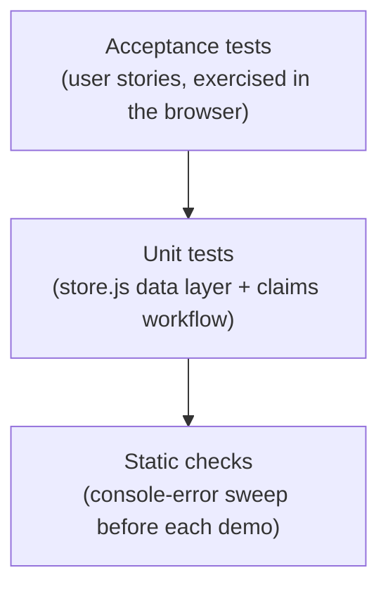

# Testing

← [Back to documentation home](README.md)

Our testing strategy: **test-driven development** for the data layer, **unit
tests** for logic, **acceptance tests** mapped to user stories, and defined
**test data**. Supports **Rubric Criterion 4 — Test**.

---

## Test strategy (test pyramid)


- **Unit** — pure logic: item/claim CRUD, status transitions, seed integrity. Run via a **zero-install browser test runner** (`iteration 3/tests/tests.html`) — no npm needed.
- **Acceptance** — each user story has a pass/fail scenario exercised in the browser.
- **Static** — every page is loaded and checked for console errors before a demo.

## Test-driven development
We wrote the claims-workflow assertions **first**, watched them fail, then
implemented `Claims.approve()` / `reject()` / `markReturned()` until they passed.
Example assertion (`iteration 3/tests/tests.js`):

```js
// approve() should set the claim Approved AND the linked item Claimed
Claims.approve(pending.id);
eq("approve() sets linked item Claimed", Store.get(pending.itemId).status, "Claimed");
```

Run the suite — **no installation required**:
```
Open  iteration 3/tests/tests.html  in a browser
(or serve it:  cd "iteration 3" && python -m http.server 8130
 then open  http://localhost:8130/tests/tests.html )
```
The runner snapshots and restores your real localStorage, so it never disturbs
app data. **Result: 35/35 passing.**

> 🐞 **Regression caught by these tests:** the runner exposed that `Store.load()`
> returned references to the seed constants, so `updateStatus` mutated `SEED_ITEMS`
> in memory and "Reset demo data" didn't fully restore. Fixed by returning parsed
> copies; a regression test now guards it.

## Unit test coverage (data layer)
| Area | What is verified |
|------|------------------|
| `Store.add` | new item gets an id, defaults (status Active, created_at) |
| `Store.updateStatus` | status changes persist |
| `Claims.add` | claim defaults to Pending with timestamps |
| `Claims.approve` | claim → Approved **and** item → Claimed |
| `Claims.reject` | claim → Rejected, item unchanged |
| `Claims.markReturned` | claim → Returned **and** item → Returned |
| `auth` guard | wrong role / signed-out is redirected |
| `Matcher.score` | identical item scores above threshold; unrelated below; reasons explained |
| `Matcher.findMatches` | returns matches, ignores non-Active and non-found items |
| `Matcher.matchesForUser` | returns only the signed-in student's lost reports |

## Acceptance tests (mapped to user stories)
| Story | Given / When / Then | Result |
|-------|---------------------|:------:|
| 1.2 | Sign in as Student → only Student nav is shown | ✅ |
| 1.3 | Signed-out user opens `admin-dashboard.html` → redirected to login | ✅ |
| 2.1 | Student submits a claim with proof → claim appears as Pending for admin | ✅ |
| 3.1 | Student reports lost item + picks map pin → item saved with that location | ✅ |
| 3.2 | Admin captures/uploads a photo + logs found item → photo stored, item on dashboard | ✅ |
| 4.2 | Admin approves a claim → item status becomes Claimed | ✅ |
| 5.3 | Student reports a lost wallet → dashboard shows "1 possible match" with reasons | ✅ |
| 5.3 | Admin views the same dashboard → no student match banner shown | ✅ |

## Accessibility checks
| Check | Implementation | Status |
|-------|----------------|:------:|
| Keyboard focus visible | `:focus-visible` gold outline on every interactive element (light ring on dark backgrounds) | ✅ |
| Skip navigation | "Skip to main content" link as the first tab stop on every page | ✅ |
| Dynamic content announced | `aria-live="polite"` on match alerts, `role="log"` on the chat, `role="status"` on success banners | ✅ |
| Validation errors announced | `role="alert"` on form error messages | ✅ |
| Images described | `alt` text on all images | ✅ |
| Motion sensitivity | `prefers-reduced-motion` disables transitions and hover transforms | ✅ |
| Language declared | `lang="en"` on all 10 pages | ✅ |
| Landmarks | `<header> <nav> <main id="main-content"> <footer>` | ✅ |

## Test data set
A deterministic seed (`store.js` → `SEED_ITEMS`, `SEED_CLAIMS`) provides 10 items
across every category/status and 2 sample claims (1 Pending, 1 Approved) so every
screen and workflow has realistic data on first load. **Reset demo data** (Admin
console) restores it for repeatable testing.

> _Note: the automated unit suite was added in Iteration 3; earlier iterations
> relied on the documented manual acceptance tests above._
