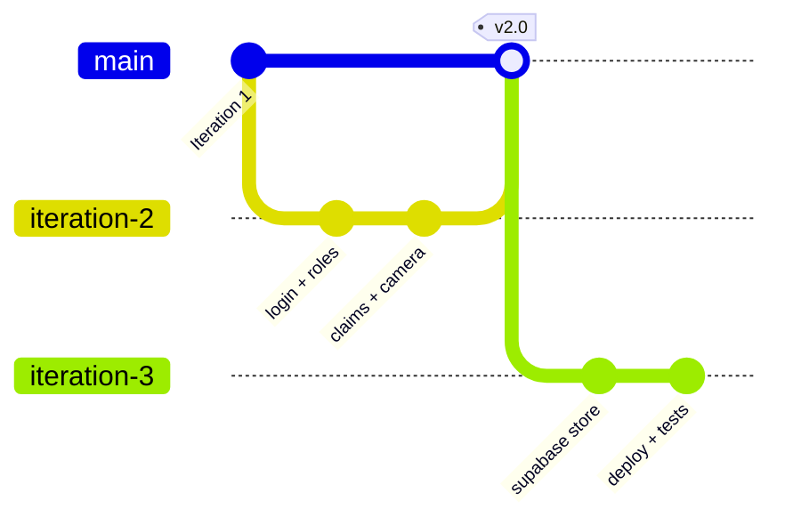

# Version Control

← [Back to documentation home](README.md)

How we use Git & GitHub. Supports **Rubric Criterion 5 — Version control**.

---

## Repository
One GitHub repository: <https://github.com/929919/Smart-Lost-and-Found-System>.

## Branching model
- `main` — always demoable / deployable (Vercel auto-deploys from it).
- `iteration-3` — active development branch for the current iteration.
- Short-lived **feature branches** per story (e.g. `feat/supabase-store`, `feat/auto-match`) merged via **Pull Request**.



## Commit conventions
Conventional, **story-tagged** messages so history maps to the backlog:
```
feat: add student claim submission form with proof of ownership (story 2.1)
feat: add admin log-found form with camera capture (story 3.2)
fix(store): handle missing JSON body safely
docs: add design and testing pages
```

## Release tags
| Tag | Meaning |
|-----|---------|
| `v1.0` | End of Iteration 1 |
| `v2.0` | End of Iteration 2 |
| `v3.0` | End of Iteration 3 (final submission) |

Tag a release: `git tag -a v2.0 -m "Iteration 2 release" && git push --tags`.

## Pull-request workflow
1. Branch from `iteration-3` per story.
2. Commit in small, story-tagged steps.
3. Open a PR → teammate reviews → merge.
4. Delete the feature branch.

This keeps `main` stable, gives every change a review, and produces a clean,
auditable history — the evidence this criterion asks for.

## Issues, milestones and the project board

Beyond commits and branches, the repository uses GitHub's planning features:

| Mechanism | Purpose | Where |
|-----------|---------|-------|
| **Issues** | One per backlog story, assigned and closed on delivery | [story issues](https://github.com/929919/Smart-Lost-and-Found-System/issues?q=label%3Auser-story) |
| **Milestones** | Group issues by iteration | [Iterations 1–3](https://github.com/929919/Smart-Lost-and-Found-System/milestones) |
| **Labels** | Epic, priority P10–P40, iteration | on every issue |
| **Project board** | Todo / In Progress / Done | [Product Backlog](https://github.com/users/uv-22/projects/1) |
| **Actions** | CI on every push and pull request | [workflow runs](https://github.com/929919/Smart-Lost-and-Found-System/actions) |

The board is owned by the `uv-22` account rather than the repository, because
GitHub only permits a user-owned project to be linked to repositories under the
same account. It is public, so it can be opened without signing in.

See [Agile Process](agile.md#task-tracking) for how this tracking was used and
when it was introduced.
